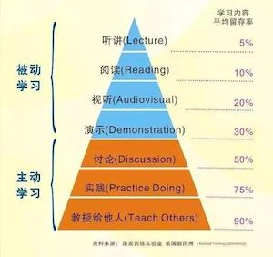

# FAQ

**Table of Contents:**

* TOC
{:toc}

---
---

## 科研方式

###  如何学习新知识和新技能？

要做好从本科生到研究生的角色转变（尤其注意不要还停留在高中生的角色），要从“被动学习”转向“主动学习”；而且，研究生和博士后不能只知道“学习”，要侧重“研究”。

> 听、读、视听、演示都属于**被动的学习**；讨论、实践、教授别人是**主动学习**。
> 其中教授给他人留存率最高，达到90%。 这一步是费曼学习法的精髓，也就是“以教促学”。所以senior students mentor junior students不仅是一种团队合作和领导力的培养，也是对自己知识的巩固。

###  如何成为一个好的研究生和科研工作者？

> 做好从本科生到研究生的角色转变，不能只知道“学习”，要侧重“研究”。

* **科研生涯的四戒律**
  1. 边干边学，不要彷徨。
  2. 勇于创新，敢于挑战。
  3. 忍受寂寞，注重过程。
  4. 掌握历史，树立信心。

* **十准则**
  1. Craft good questions
  2. Ask for help
  3. Respect and appreciate your lab mates
  4. Have at least two projects
  5. Sleep on it
  6. If you need guidance from your mentor, set up a meeting
  7. Learn when to be obsessive
  8. Start with the task you are least excited about, and do it right away
  9. Balance bouts of focused work with short breaks
  10. Get organized

* **耶鲁大学的心态理念（对于心态方面的七个建议）** （视频链接： [优酷](https://v.youku.com/v_show/id_XNDMwNjc0ODg2MA==.html) \|  [腾讯](https://v.qq.com/x/page/o075327nzri.html) \| [抖音@清华云](https://cloud.tsinghua.edu.cn/d/c93050a161224507a27e/files/?p=%2F%E8%80%B6%E9%B2%81%E5%A4%A7%E5%AD%A6%E7%9A%84%E5%BF%83%E6%80%81%E7%90%86%E5%BF%B5.mp4)）
  1. 要无条件自信，即使在做错的时候；
  2. 不要想太多，定时清除消极思想；
  3. 学会忘记痛苦，为阳光记忆腾出空间；
  4. 敢于尝试，不怕丢脸；
  5. 每天都是新的，烦恼痛苦不过夜；
  6. 面对别人的优秀，发自内心赞美；
  7. 做人最高境界不是一味低调，也不是一味张扬，而是始终如一的不卑不亢

* See More
  * [科研生涯的四戒律和十准则](https://www.yinxiang.com/everhub/note/22f83fbc-edd2-41f1-aaa7-3564c572e3ac)
  * [好导师的 16 个标准](https://www.yinxiang.com/everhub/note/1883503d-9b17-4e92-b79e-3084ba7729a0)
  * [如何成为导师眼中的好学生？如何成为学生眼中的好导师？](https://www.yinxiang.com/everhub/note/1e8fbba0-a985-465f-8bce-186d8ec37ff0)

### 导师、同学、同事之间的交流方式

**基本原则**： 导师、同学、同事之间的面谈、讨论和会议等结构化并有提前预约的好习惯 (以下约定导师和学生彼此双向适用）

* **Routine Talk & Meeting** 
    * **Group/Subgroup Meeting**: THU/FRI/SAT 2pm: project result report & discussion
       * Thursday Meeting Feedback from PI (individual talk) → Friday (4pm-6pm or 10am-12pm)
       * Friday Meeting Feedback from PI (individual talk) → Saturday (5pm-6pm or 10am-12pm)
    * **WECHAT** (**if emergency**: need answer within 24hour or less)
    * **EMAIL** (only need answer in a day or two)
* **Casual Chat**: (MON-FRI 4-6pm), PI would _answer questions/solve problems_ during this time period
* **Sunday**: SILENT except for emergency 

## 实验室规范

### 如何尽快融入到实验室的科研氛围中？

要积极了解实验室的几个研究方向，认清自己的兴趣所在；闲暇时间要多和师兄师姐交流他们的科研经验，汲取精华，要多问 （当然很多问题可能GOOGLE更方便更高效）。总结下来就是要做到主动积极，勤学好问。

### 有事没法来实验室需要提前多久请假？

  * 如非事出突然/特殊因由，请**提前一周**发email给PI（抄送实验室管理员）请假；
  * 寒暑假、国庆长假等**提前半个月到1个月**安排好工作交接和假日值班；
  * 如果只是短暂离开几个小时，可以不用请假。

### 组会和课题讨论小组会之间的差别是什么？

* 课题讨论小组会的形式随意，主要以讨论结果和细节为目的。

* 组会报告要正式一些，每周一次，每个同学基本每学期会轮到一次的组会报告，以练习正式报告甚至是答辩报告的能力为目的，可以仿照“答辩ppt”的形式，包括I. Background, II. Method, III. Result, IV. Perspective (Future Plan)几个部分。

> 大家做完报告之后都鼓励ppt上传到清华云这个文件夹下（Lu Lab Library/Lu Lab Shared/3a.PPT - Project Presentation/3a.PPT - Project Presentation），对于同一个课题的同学，实验内部默认background的slides是共享的，做报告的同学可以直接使用之前人做过（包括PI的）一些好的background slides，这样可以不断优化和积累background的slides。
>
> 清华云上（Lu Lab Library/Lu Lab Shared/3a.PPT - Project Presentation/3a.PPT - Project Presentation）还提供了一些正式的presentation的模板：Lu Lab Library/Lu Lab Shared/3a.PPT - Project Presentation：0.PPT模板； 0.优秀答辩ppt。

## 生活和财务

###  实验室活动的照片在哪里能看到？

[清华云盘链接](https://cloud.tsinghua.edu.cn/d/1c4bc3858129476eb030/?p=/&mode=grid) \| [百度网盘](https://pan.baidu.com/s/1geNXf3d#list/path=%2FLu%20Lab%20Public%20Files%2FLu%20Lab%20Public%20Photos&parentPath=%2FLu%20Lab%20Public%20Files&vmode=grid)

### 大家平时用什么方式锻炼身体？

 实验室有两个运动小组，其中之一是羽毛球小组，另一个是游泳小组，定期会组织大家一起锻炼。

###  购买科研相关的书籍或者办公用品需要开发票时，需要一般纳税人信息怎么办？

我校的增值税发票开票信息如下：

> * 单位名称：清华大学
> * 纳税人识别号：12100000400000624D
> * 地址、电话：北京市海淀区清华园 01062795627
> * 开户行及账号：工行海淀西区支行 0200004509089131550

## 远程工作

### 需要下载论文或者登录校园网，如何连接清华VPN? 

  * 方法1. 清华大学WebVPN：<https://its.tsinghua.edu.cn/info/xs_xwfw/2051>
  * 方法2. SSL VPN：<https://its.tsinghua.edu.cn/info/xs_xwfw/1081>

> 更多帮助：<https://its.tsinghua.edu.cn/column/xsfwzn>

### 如何录制讲课视频？

  * 方法一：PPT 自带录音功能 (PPT录制方法：打开PPT—点击“幻灯片放映”—录制幻灯片演示-从头开始录制—录制完选择“文件” — 保存 或者 另存为ppsx格式 或者 导出mp4格式）（ [录制指南链接](https://support.office.com/zh-cn/article/在-powerpoint-演示文稿中添加或删除音频-c3b2a9fd-2547-41d9-9182-3dfaa58f1316)  \|  [视频教程链接](https://jingyan.baidu.com/article/ce09321b7bf2042bff858f8d.html) \| [示例文件链接](https://cloud.tsinghua.edu.cn/d/fd7414d4439747ee9a08/) ）（注：可以直接保存和分享ppt文件，点播放时会自动有声音；如果不想分享源文件，可以存为带配音的＊.pps或＊.ppsx演示文稿，也可通过Powerpoint软件导出mp4（会很慢，注意等待较长时间完成导出））
  * 方法二： 在Mac上使用Quicktime录屏, 快捷键： (shift+CMD+5) 

## 数据、软件和网络

###  我们要经常备份数据吗？

* **日常的数据备份是必需的**：[How to backup your data？](https://lulab2.gitbook.io/teaching/part-i.-basic-skills/1.setup#3-backup-your-data-regularly)

###  在实验室如何上网？

目前实验室分校园网（外网：166.156.。。。）及内部网（172.22.220….）（每个座位都有标签标明外网、内网），对于校园网上网原则上使用个人帐号。
每间屋子都有无线信号覆盖（接内网），无线名为所在房间，如:lulab2110,密码联系计算机管理员获得。

###  科研办公中的常用软件如何获取和购买？

* 清华大学购买和提供了很多常用的软件，供校内师生下载和使用，包括 Windows Pro, Office, WPS，ENDNOTE, MATLAB，NOD32，卡巴斯基等。（ [下载地址：清华大学信息化服务平台](https://its.tsinghua.edu.cn) ）

* 如需购买其他特定软件，请向实验室管理员递交申请，写明需要哪种软件，以及版本号等信息。
* 此外，对大多的开源软件，清华也提供一个镜像网站，地址： [清华大学开源软件镜像站](https://mirrors.tuna.tsinghua.edu.cn/)

### How to remove cache of a redirect site?

有些时候实验室的域名更换了host的服务器，但是自己电脑cache里还是存的老服务器地址，造成一些链接没法访问，可以清除自己浏览器的cache，重新刷新一下。

例如，Mac Chrome 可以如下配置：

View --> Developer --> Developer Tools --> Settings (click upright corner)

check "*disable cache*"

