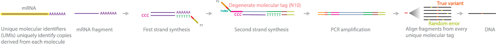

# FAQ for exRNA

* TOC
{:toc}
---
---

## exRNA: extra-cellular RNA

#### How many types of exRNAs?

**exRNA** (extra-cellular RNA) includes long and short RNAs, which can be derived from the whole plamsa/serum (**cf-RNA**: cell -free RNA), or enriched from the exosomes/EVs of plasma/serum (**exoRNA**).

* *Long RNA* (>200nt): mRNA (RNA coding for protein), lncRNA (long noncoding RNA), rRNA
* *Small noncoding RNA (ncRNA)* (20-30nt): miRNA, piRNA, siRNA
* *Ohter noncoding RNA (ncRNA)* (100-200nt): tRNA, Y RNA, snRNA, snoRNA, srp RNA, etc

 

## RNA-seq

#### What is barcode and multiplex?

**Answer:** Multiplex sequencing allows large numbers of libraries to be pooled and sequenced simultaneously during a single run on a high-throughput instrument. Sample multiplexing is useful for many applications, from targeted panels to whole human genome sequencing.

Individual "barcode" sequences are added to each DNA fragment during next-generation sequencing (NGS) library preparation so that each read can be identified and sorted before the final data analysis. Pooling samples exponentially increases the number of samples analyzed in a single run, without drastically increasing cost or time.

> Multiplex Sequencing Highlights

- *Fast High-Throughput Strategy:* Large sample numbers can be simultaneously sequenced during a single experiment
- *Cost-Effective Method:* Sample pooling improves productivity by reducing time and reagent use
- *High-Quality Data:* Accurate maintenance of read length of unknown sequences
- *Simplified Analysis:* Automatic sample identification with "barcodes" using Illumina data analysis software

#### What is TSO?

**Answer:** The TSO (template switch oligo) is an oligo that hybridizes to untemplated C nucleotides added by the reverse transcriptase during reverse transcription. The TSO adds a common 5' sequence to full length cDNA that is used for downstream cDNA amplification.

The TSO is used differently in the Single Cell 3' assay compared to the Single Cell 5' assay. In the 3' assay, the polyd(T) sequence is part of the gel bead oligo (which also contains the 10x Barcode, UMI, and partial Illumina Read 1 sequence), with the TSO supplied in the RT Primer. In the 5' assay, the polyd(T) is supplied in the RT Primer, and the TSO is part of the gel bead oligo.

Single Cell 3' assay after reverse transcription:

 

Single Cell 5' assay after reverse transcription:

Products: Single Cell 3', VDJ

> See more in [PDF](https://github.com/lulab/lulab.github.io/blob/master/exRNA/FAQ/pdf/TSO.pdf) or [Web](https://kb.10xgenomics.com/hc/en-us/articles/360001493051-What-is-a-template-switch-oligo-TSO-)

#### What is UMI?

**Answer:** Unique molecular identifiers (UMI) are molecular tags that are used to detect and quantify unique mRNA transcripts. In this method, mRNA libraries are generated by fragmentation and reverse-transcribed to cDNA. Oligo(dT) primers with specific sequencing linkers are added to the cDNA. Another sequencing linker with a 10 bp random label and an index sequence is added to the 5' end of the template, which is amplified and sequenced. Sequencing allows for high-resolution reads, enabling accurate detection of true variants.

> Pros:

- Can sequence unique mRNA transcripts
- Can detect transcripts occurring at low frequencies
- Transcripts can be quantified based on sequencing reads specific to each barcode
- Can be applied to multiple platforms to karyotype chromosomes

> Cons:

- Targets smaller than 500 bp are preferentially amplified by polymerases during PCR

> Reference:

- [Kivioja T., Vaharautio A., Karlsson K., Bonke M., Enge M., et al. (2012) Counting absolute numbers of molecules using unique molecular identifiers. Nat Methods 9: 72-74](http://www.ncbi.nlm.nih.gov/pubmed/22101854)

  

